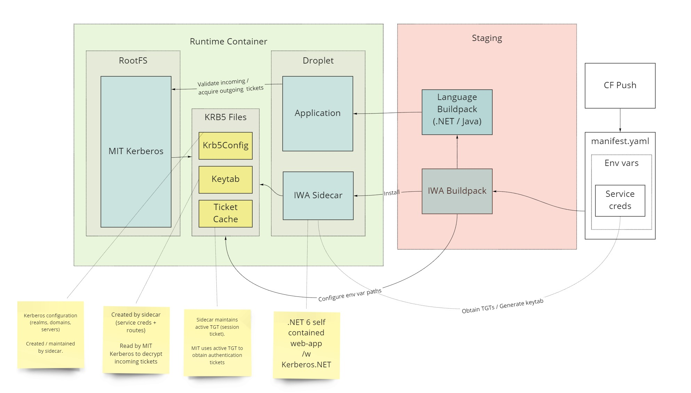

This buildpack sets up Kerberos authentication on Linux, allowing Kerberos and Integrated Windows Authentication to work natively in .NET and Java apps. 

## How to use

Set the following environmental variables for your app:

`KRB_SERVICE_ACCOUNT`: service account under which app runs in `username@domain.com` format 
`KRB_PASSWORD`: service account password
`KRB_KDC`: (optional) Kerberos Key Distribution Center address. Defaults to domain part of `KRB_SERVICE_ACCOUNT`

Ensure that you have right SPNs in place for the service you're trying to authenticate to.

Sample manifest:

```yaml
---
applications:
- name: TestKerberos
  path: bin/Debug/net5.0/publish
  random-route: true
  memory: 512M
  health-check-type: none
  buildpacks: 
    - https://github.com/macsux/kerberos-buildpack/releases/download/v1.0.6/KerberosBuildpack-linux-x64-v1.0.6.zip
    - dotnet_core_buildpack
  env:
    KRB_KDC: ad.almirex.com
    KRB_SERVICE_ACCOUNT: iwaclient@almirex.dc # MUST BE in format sAMAccountName@KerberosRealm
    KRB_PASSWORD: P@ssw0rd

```

** Adjust URL of the Kerberos buildpack to latest version. You can get the full zip URL from [Releases](https://github.com/macsux/kerberos-buildpack/releases) page.

## How it works




Core libraries used by .NET and Java apps use MIT Kerberos to do Kerberos (aka Integrated) authentication when running on Linux. This buildpack configures MIT Kerberos, and obtains the necessary initial TGT tickets necessary for the app to acquire authentication tickets.

A sidecar runs in background that will obtain tickets Kerberos .NET 

## Secure credentials with CredHub integration

Instead of of injecting service credentials as environmental variables, this buildpack supports injecting it securely via CredHub integration. This will safely store creds associated with the app inside CredHub, and they will be injected as environmental variables when container starts. This will be only visible from the app - they will not be visible if the user tries to query environmental variables associated with the app.

#### Prerequisite: [CredHub service broker](https://network.tanzu.vmware.com/products/credhub-service-broker) installed on the platform

1. Omit KRB_SERVICE_ACCOUNT / KRB_PASSWORD from the manifest

2. Create a file creds.json that looks similar to this:

   ```json
   {
       "ServiceAccount": "iwaclient@macsux.com",
       "Password": "P@ssw0rd"
   }
   ```

3. Create a CredHub service instance that carries the above credentials as following:

   ```
   cf create-service credhub default CREDS_SERVICE_INSTANCE_NAME -c .\creds.json -t kerberos-service-principal
   ```

4. Bind the credentials to the app

   ```
   cf bind-service APP_NAME CREDS_SERVICE_INSTANCE_NAME
   ```

5. Push the app

## Managing credentials via service binding

Instead of setting credentials directly as environmental variables, you can manage them as Custom User Provided Service and bind them to the app. In order to use CUPS, follow same steps as CredHub integration, but instead of creating credhub instance in step #3, create cups as following:

```
cf cups kerberoscreds -p .\creds.json -t kerberos-service-principal
```

  

## Embedding Kerberos configuration into buildpack

By default the buildpack will attempt to generate an MIT Kerberos configuration file (krb5.conf) out of combination of KRB_KDC and the realm portion of the service account (everything after `@`). This may not be sufficient in more complex environments and require full control of the `krb5.conf` to properly work. It may also be desirable to not have to include location of the KDC in the push manifest. In order to support these scenarios, the buildpack allows embedding `krb5.conf` before being deployed on the platform. This has the advantage of being uniformly applied to all apps and move control over this file in the hands of central platform operator. In order to include environment specific `krb5.conf` in the buildpack, it must be placed into the buildpack zip file under `/deps/.krb5/krb5.conf`. This can be accomplished by creating a local directory structure that looks like this:

```
.
├── KerberosBuildpack-linux-x64-v1.0.0.zip
├── deps
│   └── .krb5
│       └── krb5.conf
```

After run the following command to patch the zip file with config file:

Powershell

```
Compress-Archive -Update -Path deps -DestinationPath KerberosBuildpack-linux-x64-v1.0.0.zip
```

Linux shell

```
zip -ur KerberosBuildpack-linux-x64-v1.0.0.zip deps
```

### Multiple environment control

If krb5.conf need to be different across environments, multiple krb5.conf can be embedded into the buildpack by creating a folder structure similar to the following and applying steps above:

```
.
├── KerberosBuildpack-linux-x64-v1.0.0.zip
├── deps
│   └── krb5
│       ├── prod
│       │   └── krb5.conf
│       └── qa
│           └── krb5.conf
```

 You can control which `krb5.conf` is used by setting `KRB_ENVIRONMENT` environmental variable so it matches the folder name.

## Troubleshooting

Recommendation is to start with sample app included, which exposes the folowing endpoints:
`/user` - which will authenticate incoming HTTP principal and print caller's identity. Simply call this endpoint on domain joined box from browser
`sql` - tests kerberos connection to SQL Server. Set connection string either in `appsettings.json` or via environmental variable `CONNECTIONSTRINGS__SQLSERVER`.
`/testkdc` - verify that connection can be established to KDC server on port 88.

After the app starts up you should see logs emitted from sidecar process that look like this:
```csharp
   2022-01-26T19:04:14.26-0500 [APP/PROC/WEB/0] OUT info: KerberosSidecar[0]
   2022-01-26T19:04:14.26-0500 [APP/PROC/WEB/0] OUT       Kerberos sidecar started....
   2022-01-26T19:04:14.74-0500 [APP/PROC/WEB/0] OUT info: KerberosSidecar.KerberosWorker[0]
   2022-01-26T19:04:14.74-0500 [APP/PROC/WEB/0] OUT       Service authenticated successfully as 'iwaclient'
   2022-01-26T19:04:14.75-0500 [APP/PROC/WEB/0] OUT info: KerberosSidecar.Spn.LoggingSpnClient[0]
   2022-01-26T19:04:14.75-0500 [APP/PROC/WEB/0] OUT       Ensure that the following SPN for the service exists: http/kerberosdemo.apps.longbeach.cf-app.com
```

* sidecar logs may be intermixed with app logs

If you have not received a message similar to `Service authenticated successfully as 'iwaclient'`, it means that the worker sidecar has been unable to obtain ticket from your KDC.

#### Things to check 

- Sidecar process started, as indicated by log entry containing `Now listening on: http://0.0.0.0:9090`. (note port 9090 - there maybe similar log entry but for port 8080 - that one is for the main app).
- Credentials are correct and specified in the right format
- KDC is accessible from the container. Use `/testkdc` endpoint of sample app to test.
- Acquire additional logging from sidercar by turning up Kerberos related log verbosity by adding the following env var:
  - `Logging__LogLevel__Kerberos: Debug`